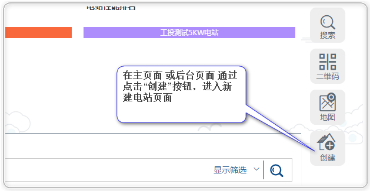
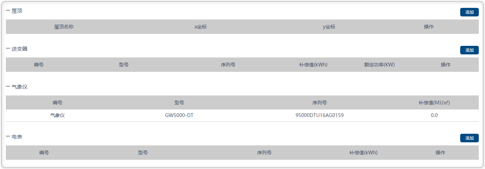
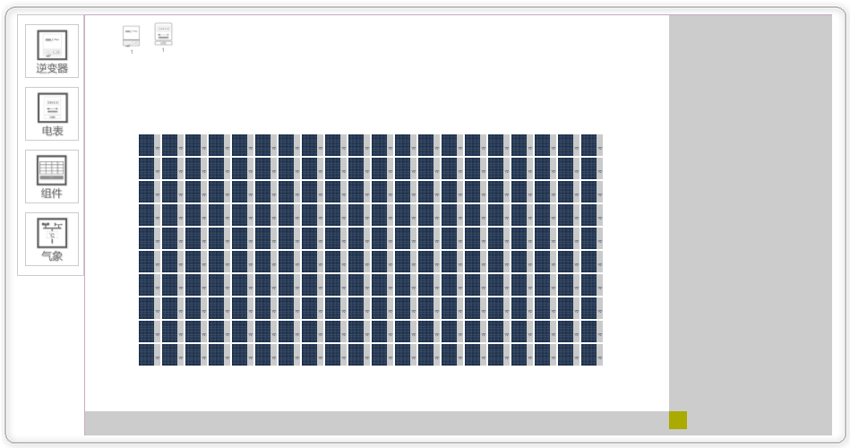
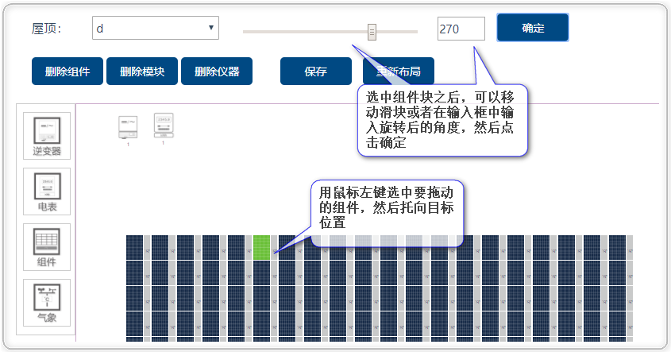
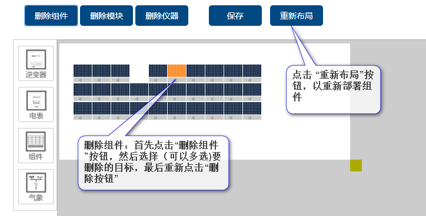
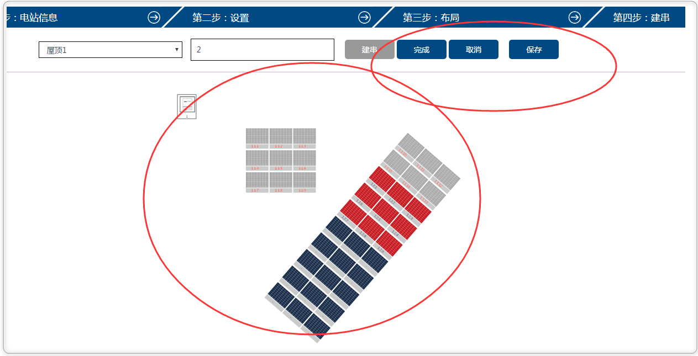
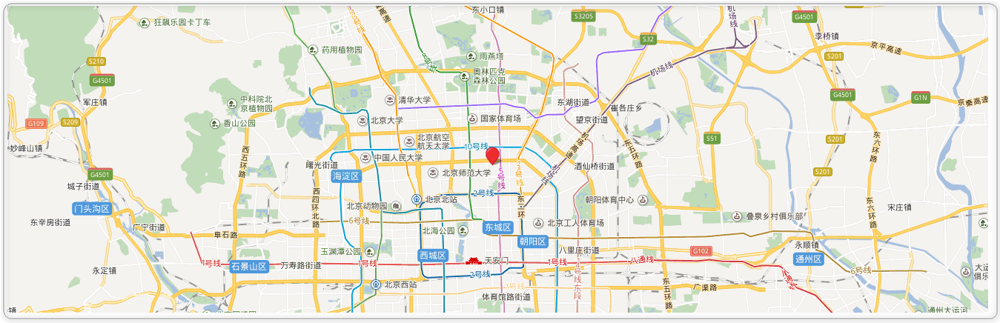

# 新建电站

### 进入建电站系统

### 配置电站的基本信息

### 电站设置页面

点击“屋顶”、“逆变器”、“气象仪”、“电表”等对应的“添加”按钮，添加相应的设备和信息

### 电站布局页面

* 进入“电站布局”界面，点击左侧设备按钮，添加电站设备（组件提供横排和竖排两种方案）

* 电站设备添加至画布后，可以物理位置的拖动，已满足电站实际布局；电站布局完成后，拖动视窗方格，实现视窗大小定制，同时针对模块提供角度转变的功能（注：此处电站物理摆放位置与电站物理位置保持一致）

* 系统提供针对仪器、模块、组件的删除操作，点击“删除组件”、“删除模块”、“删除仪器”等按钮，选择对应选项，再次点击此按钮，可以实现删除操作；“保存”按钮为保存当前屋顶设备布局，“重新布局”按钮将实现整体布局重新部署

### 建串

“页面布局”完成后，点击“下一步”，进入建串页面，点击“逆变器”——“建串”按钮——输入串名——选中串下组件——点击“完成”，当前屋顶串创建完成后，点“保存”按钮，完成当前屋顶的串建设（注：系统自动标注选中设备顺序，例1-1-1，逆变器名-组串名-第几块组件）

### 地图定位

“建串”完成后，点击下一步，进入地图定位功能，在地图上标注电站所在位置：

### 手机扫码

“地图定位”完成后，提示“基本操作已完成，请再APP上完成扫码操作”，下一步将等待APP完成组件编码与电站位置的对应的扫码操作（注：扫码完成后，系统自动标注电站创建完成）：

