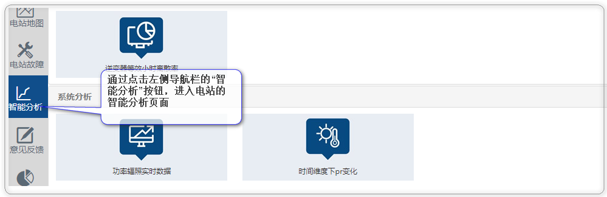
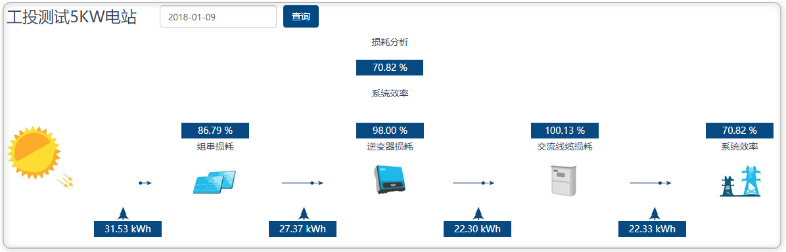
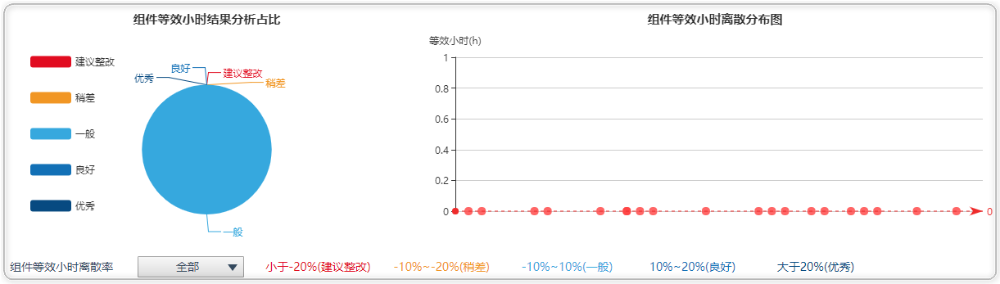
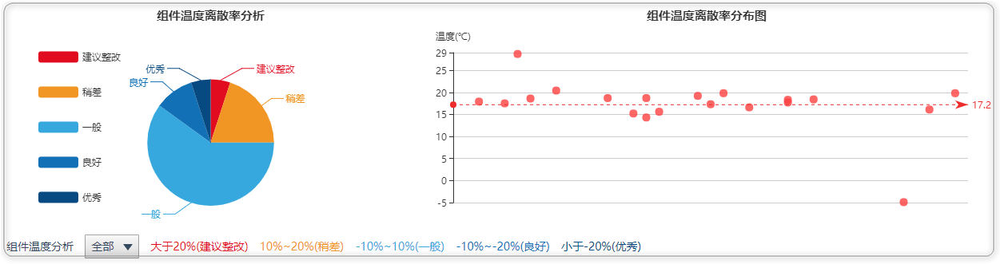
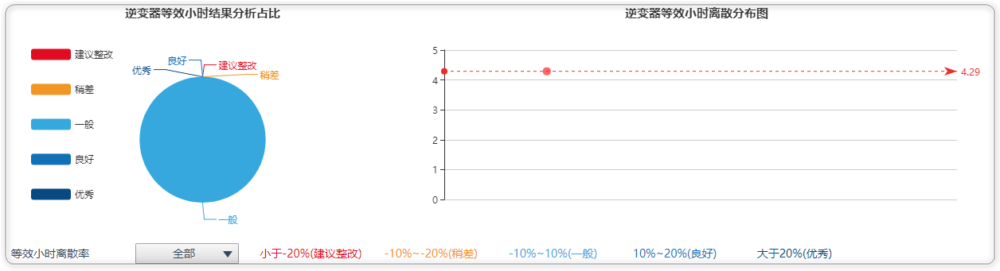
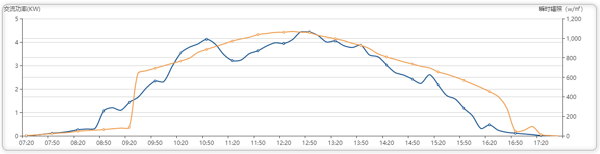

# 智能分析

智能分析针对当前电站的发电性能作出的一系列分析，通过分析结果和过程展示，电站维护人员更加清晰的了解电站情况

### 智能分析页面的进入

### 系统损耗分析

点击“系统损耗”，进入电站发电的详细损耗分析图，针对理论发电量、设备损耗等环节作出详细罗列和介绍

### 组件等效小时离散率分析

组件等效小时离散率是针对组件发电量情况做的统计计算，通过每块组件与平均等效小时的离散率来评判组件发电量的情况，可查看历史发电状况

### 组件温度离散率分析

组件温度离散率是针对组件温度情况做的统计计算，通过每块组件与平均温度的离散率来评判组件发热异常，可以选择历史时间

### 逆变器等效小时离散率分析

逆变器等效小时离散率是针对逆变器发电量情况做的统计计算，通过每个逆变器与平均等效小时的离散率来评判组件发电量的情况，可查看历史发电状况

### 功率辐射实时数据

功率辐照实时数据是展示指定日期的交流功率和日辐照度展示和对比，从而了解指定天的发电趋势和辐照的关系和对比

### 时间维度下Pr变化

此处功能主要是展示该电站在时间维度下的Pr变化曲线了，分为月/年统计

