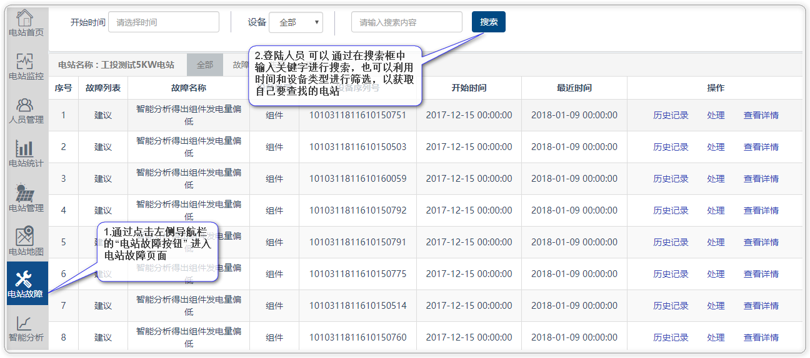
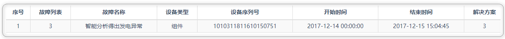
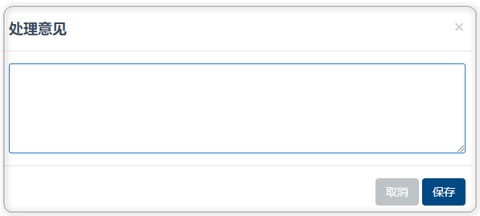
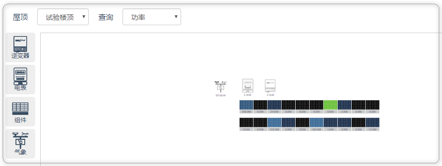

# 电站故障

故障页面详细的罗列了，当前登陆人员名下发生故障的电站；已登入人员可查看当前电站的故障列表，并支持“故障”、“告警”、“建议”等多种选项过滤和搜索：

### 故障页面进入

### 故障页面的基本使用

* 点击列表操作按钮“历史记录”会连接至当前故障设备的历史故障详情以及解决方案

* 点击“处理”会弹出一个表单，用户可以填写本次故障的解决方案，以作为历下次故障解决的参考

* 点击“查看详情”，可以连接至当前设备所对应的监控图

