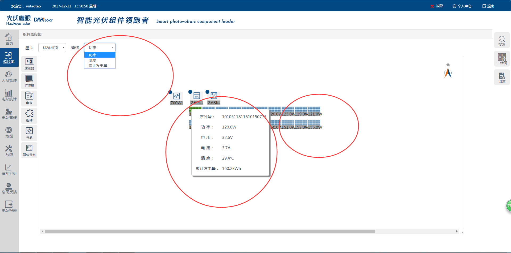
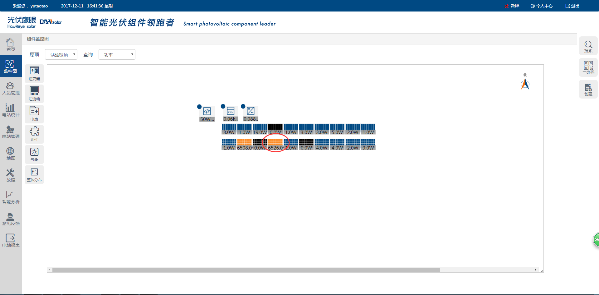
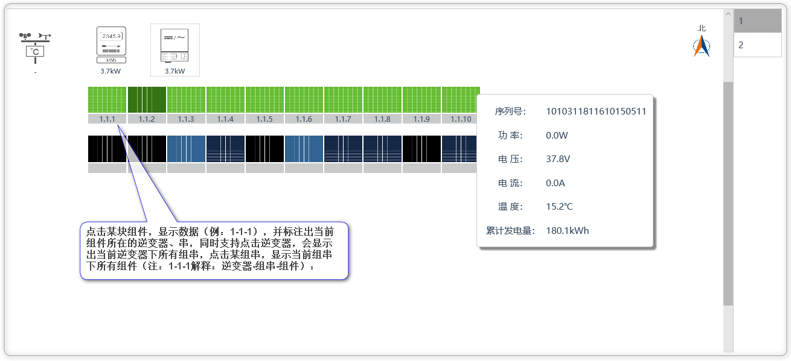
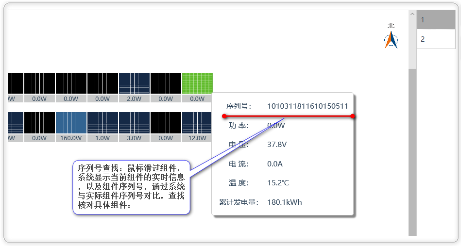

# 电站监控

实现实时监控当前电站的运行情况，并能观察到每个组件详细的实时发电功率、温度等，同时针对故障、高温等情况及时报警（显红）。针对运维情况，提供物理位置、逻辑方位、序列号对比等多种形式的查找，在保证快速、准确查找到指定组件的同时，确保了正确性。

## 实时数据展示

系统针对电站每一块组件，展示其实时数据的详细内容，并实现了实时功率、实时温度、累计发电量等多种查看，以及鼠标停放组件上时，弹框展示组件的序列号、实时功率、实时电流、实时电压、实时温度、累计发电量，同时，组件不同的发电功率，也会有不同的颜色渐变显示，使得用户更加方便快捷的观察每个组件的当前功率，具体如图：

## 故障报警

针对有故障的逆变器、组件等设备，系统再实时数据显示时会针对故障设备给予不同颜色的显示以达到报警的目的，故障：红色，告警：黄色：

## 组件查找

### 针对故障组件，系统提供查找和准确定位的方案：

* 物理方位查找：系统组件监控图组件显示的位置与实际电站组件位置完全一致，登陆人员可以通过指北针和实际物理位置来确定组件的位置：

* 序列号查找：鼠标滑过组件，系统显示当前组件的实时信息，以及组件序列号，通过系统与实际组件序列号对比，查找核对具体组件：

