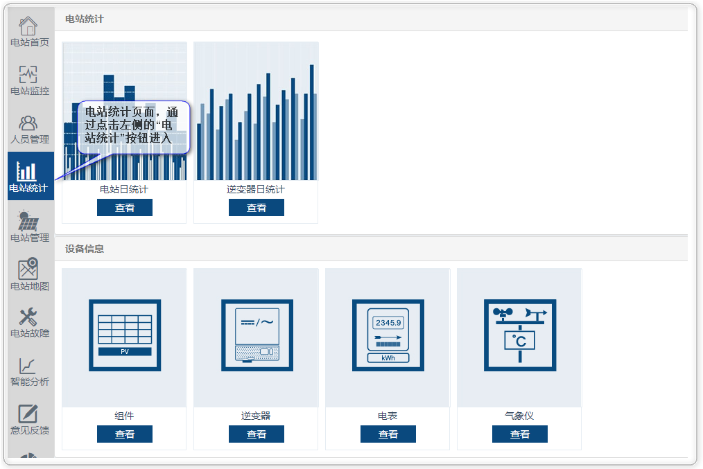
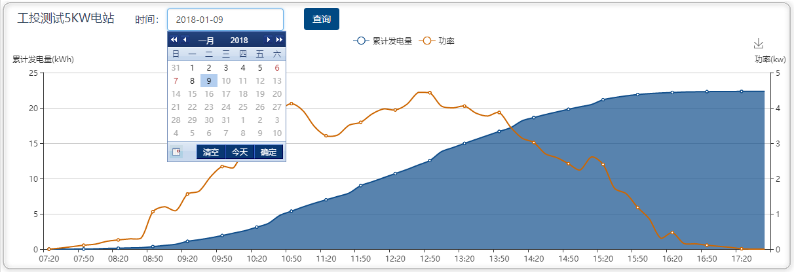
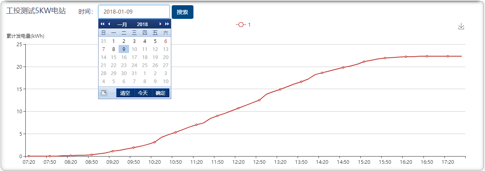
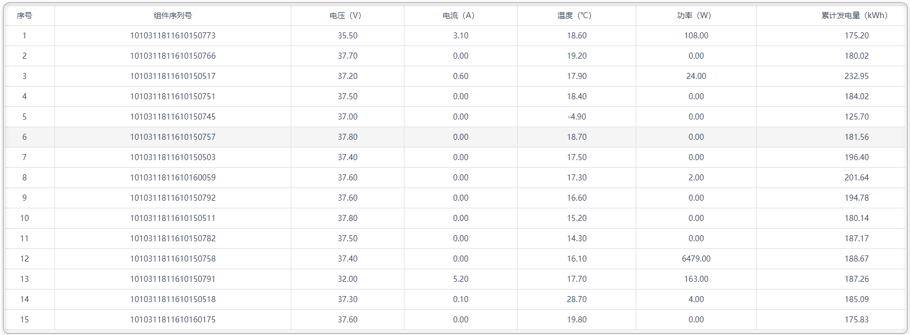
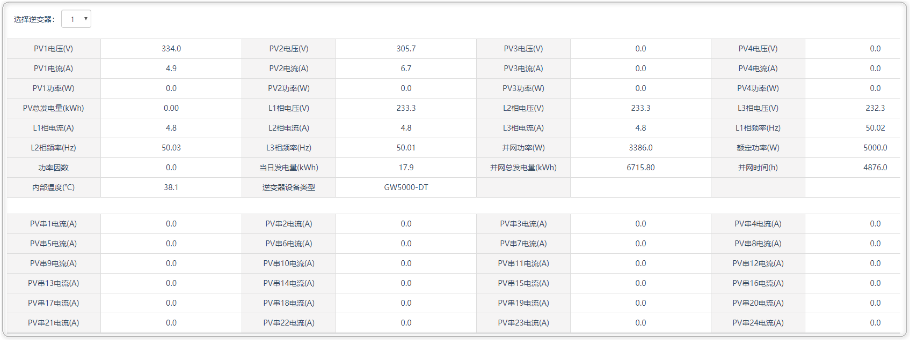
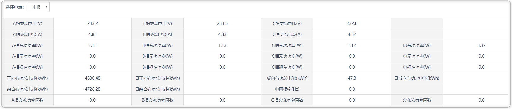
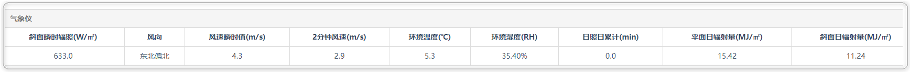

# 电站统计

电站统计详细罗列了，当前登入电站的日发电量 | 日发电功率 | 日累计发电量，以及电站各部分组件的详细信息。

### 电站统计页面的进入

### 电站日统计

点击“电站日统计图”，进入查看当前电站日发电量和辐照度的对应走势图以及详细的数据展示列表，并可以查看历史每一天的数据：

### 逆变器日统计

点击“逆变器日统计图”进入到当前电站下所有逆变器日运行情况的查看，并可以查看历史每一天的运行情况：

### 设备信息

#### 组件信息

点击“组件”，可以查看到当前电站下所有组件列表：

#### 逆变器信息

点击“逆变器”，可以查看到当前电站指定逆变器的详细信息：

#### 电表信息

点击“电表”，可以查看到当前电站指定电表的详细信息：

#### 气象仪信息

点击“气象仪”，可以查看到当前电站气象仪的详细信息：

