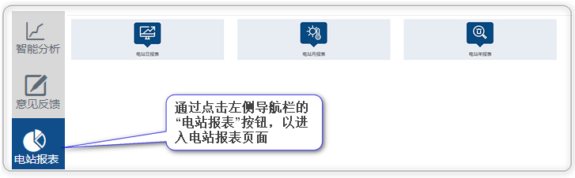
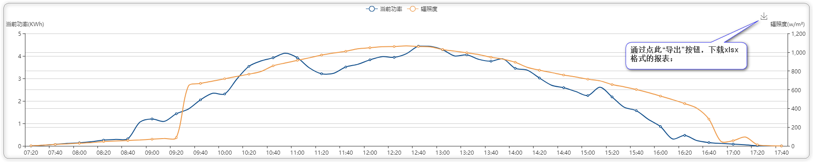
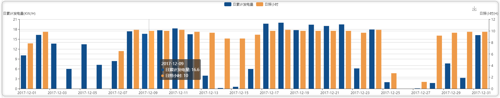
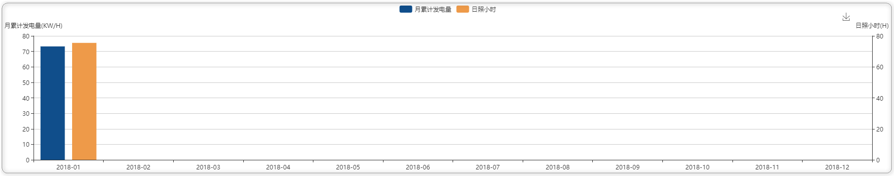

# 电站报表

针对集团人员，此处提供针对指定电站的数据内容导出，导出格式为xlsx格式，导出内容为图表以及相应的数据展示，主要针对电站、组件、逆变器级别的数据导出：

### 进入电站报表页面

### 电站日发电量报表

电站日报表：此处为指定电站的日报表信息展示，通过导出按钮，可以将数据内容导出至指定位置的xlsx表格，命名为日期—电站id：

### 电站月发电量报表

电站月报表：此处为指定电站的月报表信息展示，通过导出按钮，可以将数据内容导出至指定位置的xlsx表格，命名为日期—电站id

### 电站年发电量报表

电站年报表：此处为指定电站的年报表信息展示，通过导出按钮，可以将数据内容导出至指定位置的xlsx表格，命名为日期—电站id

